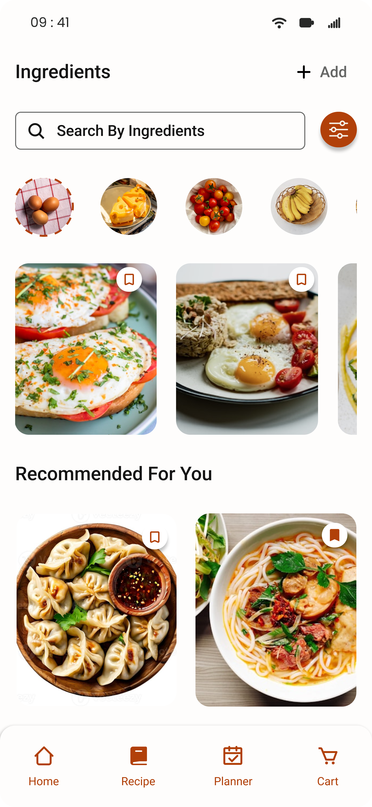
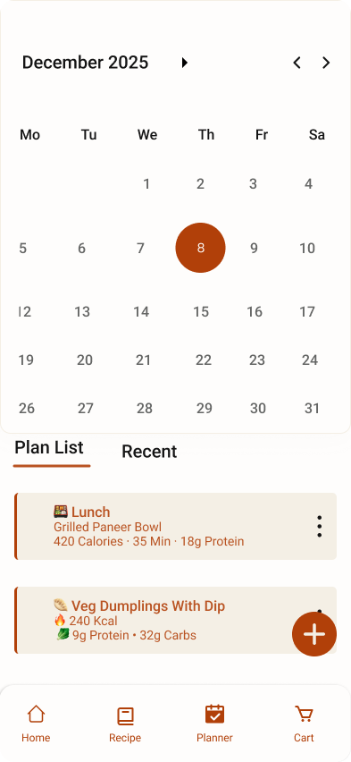
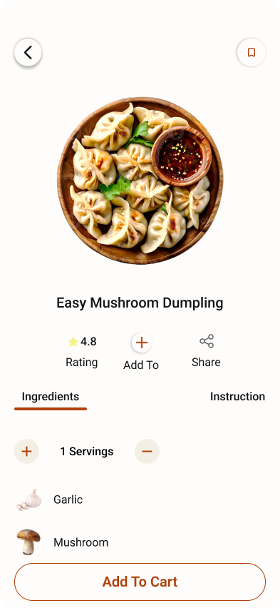

# MealBridge – UI/UX Case Study

## 📱 Overview
MealBridge is a mobile app designed to simplify meal planning, recipe discovery, and grocery shopping.

## 🎯 Problem Statement
Users often struggle with planning meals and managing grocery shopping efficiently.

## 💡 Solution
MealBridge provides a seamless experience to discover recipes, plan meals, and manage grocery lists in one place.

## 🎯 Key Features
- Personalized recipe suggestions
- Meal planning calendar
- Grocery list integration

---

## 🖼️ Main Screens  

### Home Screen  

### Recipe Screen  

### Meal Planner (Calendar)  

### Recipe Ingredients  

---

## 🔐 Authentication Flow

### Splash Screen  

### Login  

### Signup  

### Forgot Password  

### OTP Verification  

### Reset Password  

