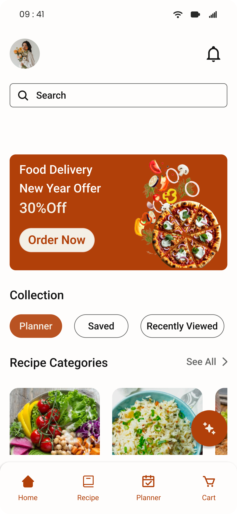
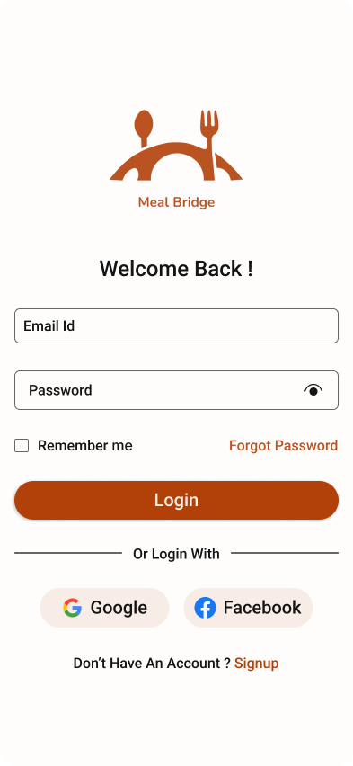
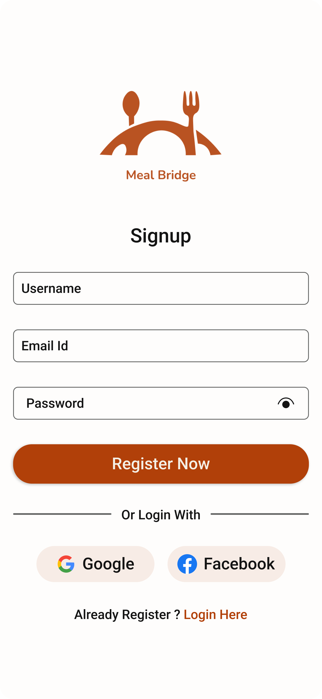
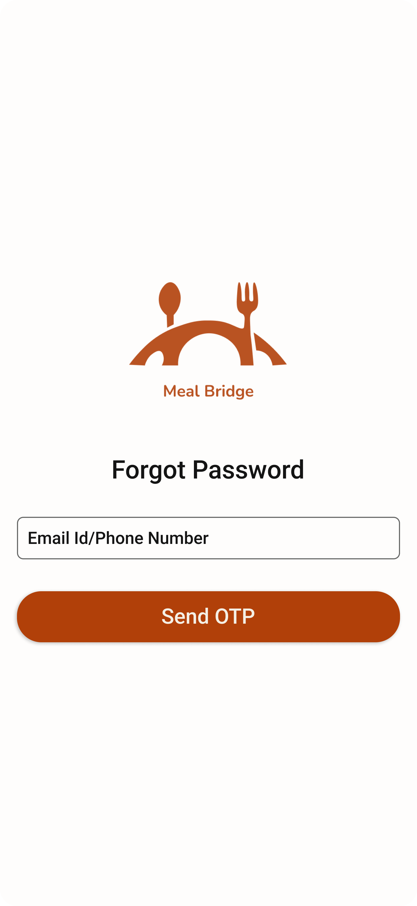
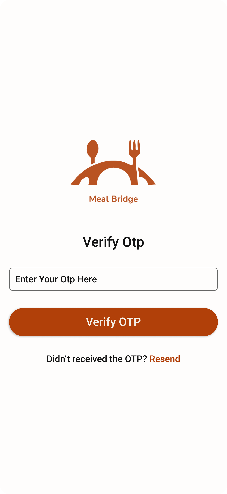
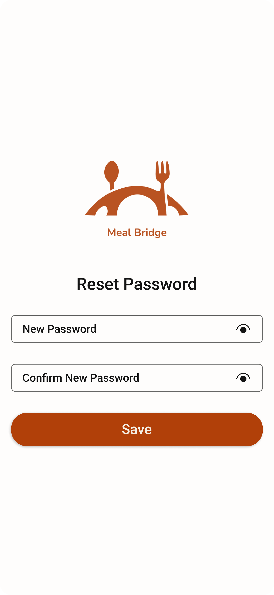

# MealBridge – UI/UX Case Study

## 📱 Overview
MealBridge is a mobile app designed to simplify meal planning, recipe discovery, and grocery shopping.

## 🎯 Problem Statement
Users often struggle with planning meals and managing grocery shopping efficiently.

## 💡 Solution
MealBridge provides a seamless experience to discover recipes, plan meals, and manage grocery lists in one place.

## 🎯 Key Features
- Personalized recipe suggestions
- Meal planning calendar
- Grocery list integration

---

## 🖼️ Main Screens

### Home Screen

---

## 🔐 Authentication Flow

### Splash Screen

### Login

### Signup

### Forgot Password

### OTP Verification

### Reset Password

